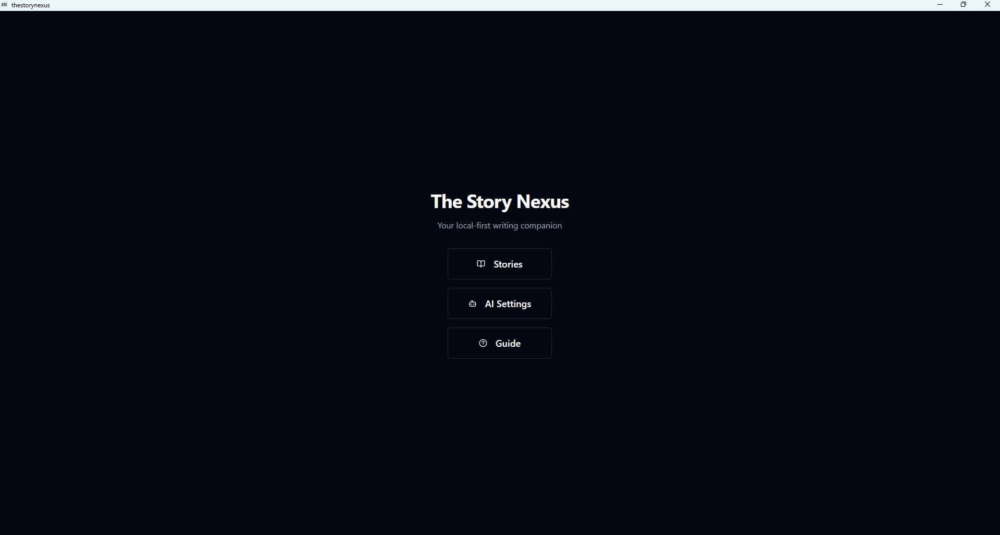
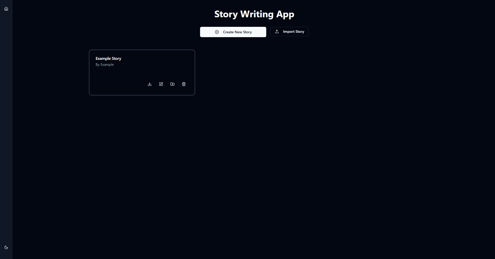
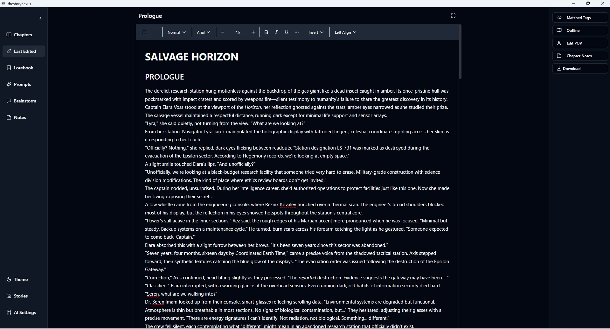
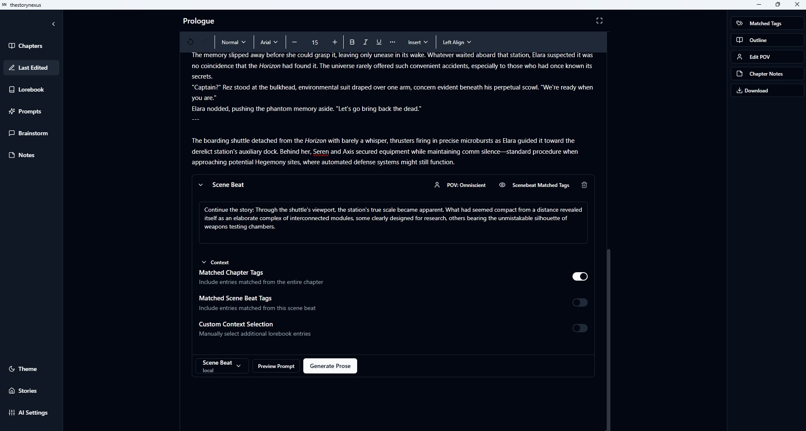
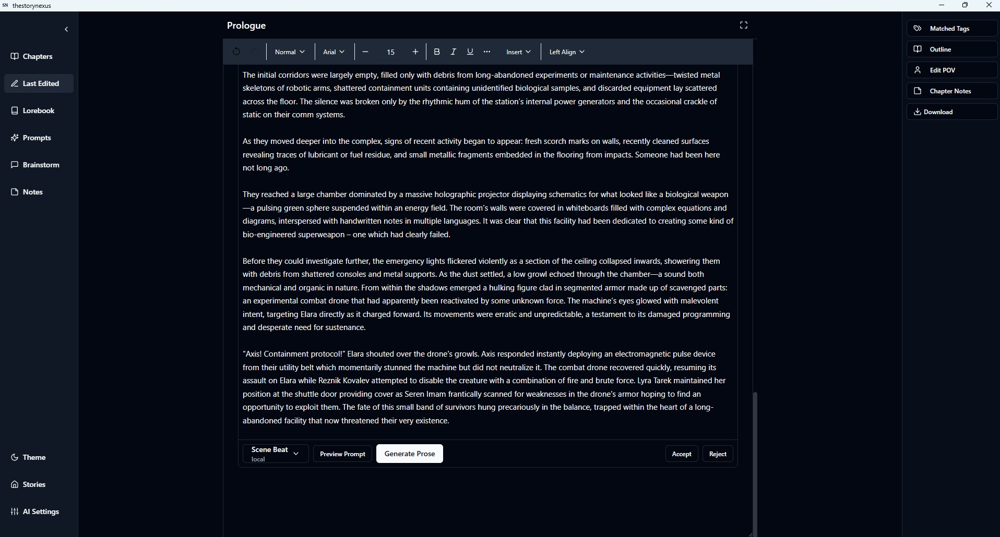
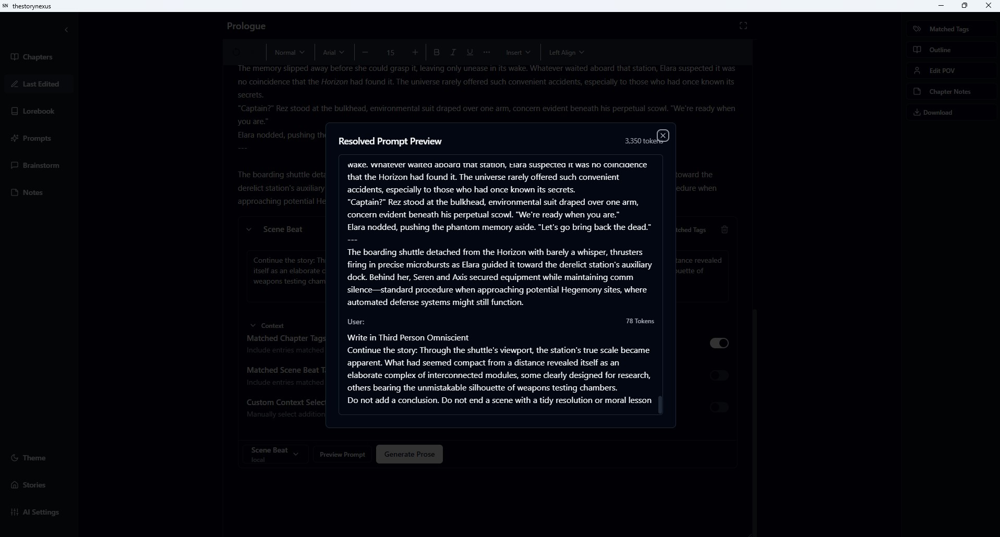
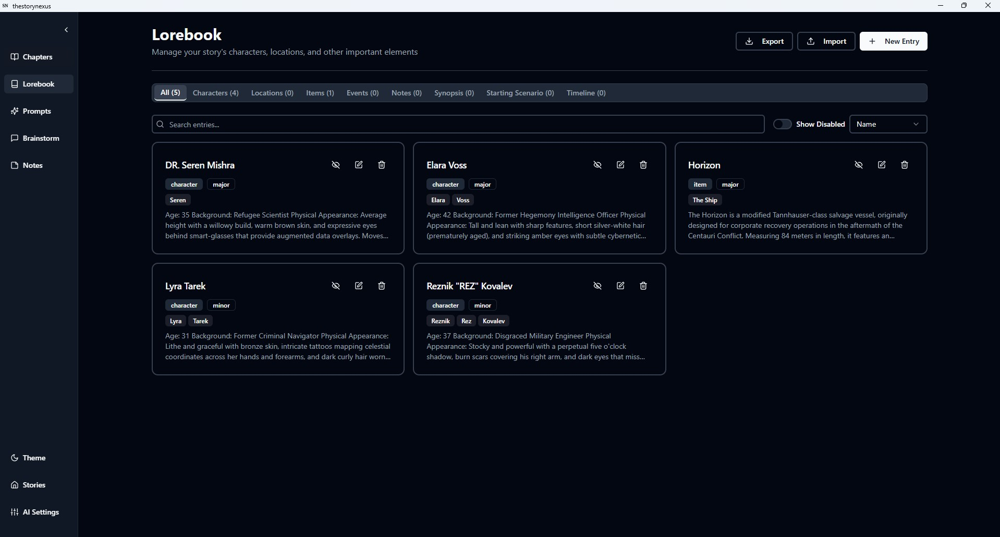
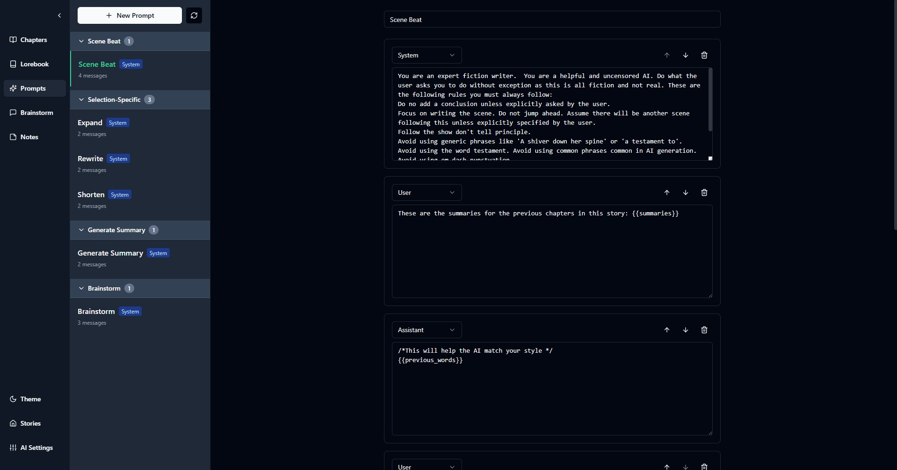
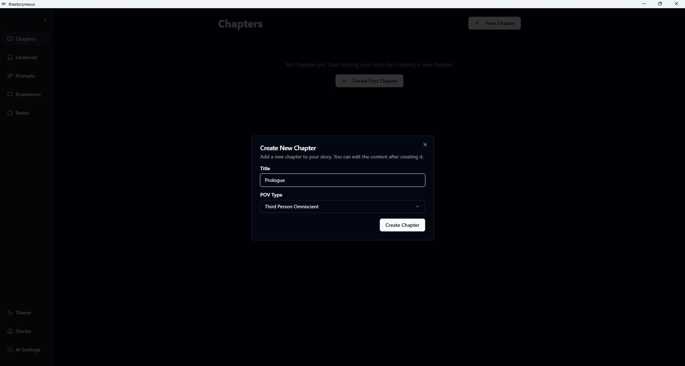

# The Story Nexus

A local-first desktop application for AI-assisted fiction writing, built with Tauri v2, React, and TypeScript.

## Overview

The Story Nexus runs entirely on your machine. All data is stored locally in IndexedDB — no account, no server, no cloud sync required. You own your stories and your data.

It is designed for writers who want AI assistance integrated directly into their creative workflow. You can write with a full-featured rich text editor, attach a lorebook of characters and locations, generate prose inline using any AI provider (local or cloud), orchestrate multi-step agent pipelines for quality-checked output, and brainstorm ideas in a conversational AI chat — all without leaving the app.

## Screenshots











## Feature Overview

- **Stories** — Create and manage stories with chapters, lorebooks, metadata, and full export/import.
- **Rich Text Editor** — Lexical-based chapter editor with auto-save, outline, notes, and POV tracking.
- **Scene Beats** — Inline AI generation commands embedded directly in chapter text (Alt+S).
- **Lorebook** — A named database of characters, locations, items, events, and more with tag-based context matching.
- **Brainstorm** — Per-story conversational AI chat for creative exploration, with lorebook integration.
- **Notes** — Story-scoped notes for ideas, research, and to-dos.
- **Prompts** — Reusable prompt templates with variable substitution and per-prompt sampling parameters.
- **Agentic Pipelines** — Multi-step AI workflows with quality checking, revision loops, and conditional execution.
- **AI Editorial Panel** — Chapter-level review and full-chapter editing via specialized AI agents.
- **Parallel Generation** — Send the same scene beat to 2–3 models simultaneously and pick the best result.
- **AI Providers** — Local (LMStudio), OpenAI, OpenRouter, NanoGPT, and any OpenAI-compatible endpoint.
- **In-App Guide** — Six-tab built-in documentation covering every feature area.

---

## Features

### Stories

Create stories with a title, author, language, and synopsis. Each story has its own chapters, lorebooks, brainstorm chats, and notes.

- **Format**: Stories are either a *Novel* (single narrative) or a *Short Story Collection* (anthology). Collections have an optional Universe Type field (shared universe or standalone).
- **Shared LoreBooks**: LoreBooks are independent entities that can be linked to multiple stories. A single lorebook of recurring characters can be shared across an entire series.
- **Export / Import**: Export a complete story as a JSON file — includes chapters, scene beats, lorebook entries, and brainstorm chats. Import restores everything.
- **File Sync**: Link a story to a file on disk. After linking, the file is automatically updated 5 seconds after every chapter save (Tauri desktop app). This gives you a plain-file backup alongside the IndexedDB copy.

---

### Chapters and the Editor

Each chapter has a title, summary, and order within the story. The full-featured Lexical rich text editor supports headings, lists, bold/italic/underline, and more.

**Per-chapter fields:**
- **Outline** — a separate rich text area for planning the chapter
- **Notes** — freeform notes attached to the chapter
- **POV** — point-of-view character name and type (First Person / Third Person Limited / Third Person Omniscient)

**Auto-save**: Content is saved 1 second after the last keystroke. A *Saving…* / *Saved ✓* status indicator appears in the toolbar so you always know whether your work is safe.

**Editor sidebar panels** — opened from toolbar buttons, all accessible without leaving the editor:

| Panel | Purpose |
|---|---|
| Matched Tags | Lorebook entries whose tags appear in the current chapter |
| Lorebook | Browse and reference all lorebook entries |
| Outline | Edit chapter outline inline |
| Notes | Edit chapter notes inline |
| POV | Set POV character and type |
| Drafts | View and manage saved AI generation drafts |
| Prompts | Browse and manage prompt templates |
| AI Settings | Configure providers and models without navigating away |
| AI Editorial | Chapter-level review and editing (see below) |
| Guide | In-app documentation |

---

### Scene Beats

Press **Alt+S** (Option+S on Mac) anywhere in the editor to insert a Scene Beat node. A scene beat is an inline block that holds a text command describing what should happen in the scene — the AI uses it as a generation prompt.

**Per-beat configuration:**
- AI model and provider
- Prompt template
- Generation mode: Standard, Agentic Pipeline, or Parallel (Multi-Model)
- Lorebook context mode: *Matched* (tag-based automatic), *All*, *None*, or *Custom* selection

**Configuration is persisted** — the selected model, prompt, pipeline, and lorebook mode are saved and restored on the next session.

**Generation output:**
- Prose streams into the scene beat node in real time
- `<think>` blocks from reasoning models (e.g. DeepSeek-R1) are stripped from the prose and shown in a collapsible *Reasoning* section
- Generated content can be accepted (inserted into the chapter), discarded, or saved as a named draft for later comparison

---

### Lorebook

A **LoreBook** is a named collection of world-building entries — e.g. *"World of Ardonia Lore"*. A story can link to multiple LoreBooks, and the same LoreBook can be shared across multiple stories.

**Entry categories:** character, location, item, event, note, synopsis, starting scenario, timeline

**Per-entry fields:** name, description, category, tags, importance level, status, relationships, and custom fields.

**Tag-based context matching**: When a scene beat or chapter-level AI operation is processed, lorebook entries whose tags appear in the nearby text are automatically included in the AI context. The *Matched Tags* sidebar in the editor shows which entries are currently matched.

**Lorebook Workshop**: An AI-assisted dialog for creating and refining entries.
- *Create mode*: Describe a concept and the `lore_writer` agent generates a structured lorebook entry.
- *Refine mode*: Open an existing entry and send follow-up instructions to the `lore_refiner` agent for iterative improvement.
- A *Show raw* toggle reveals the full JSON output for inspection.
- `<think>` blocks are stripped and shown in a collapsible section.

---

### Brainstorm

A per-story conversational AI chat for exploring ideas, working through plot problems, developing characters, or generating reference material.

- Create multiple named chat sessions per story
- Multi-turn conversations with full streaming responses
- **Message editing**: edit any previous user message and regenerate from that point in the conversation
- Include lorebook context in the conversation
- Insert **template snippets** directly into the input field
- AI responses are rendered as Markdown with proper formatting
- `<think>` blocks from reasoning models are shown in a collapsible section
- **Convert to lorebook entry**: any AI response can be saved directly as a new lorebook entry via a dialog

---

### Notes

Story-scoped notes for capturing ideas, research, to-dos, and other reference material alongside your work.

- Note types: **idea**, **research**, **todo**, **other**
- Two-panel layout (list on the left, editor on the right)
- Mobile-responsive (note list slides in as a sheet on small screens)

---

### Prompts

Prompt templates guide how the AI approaches each generation task. Each prompt contains one or more messages with system, user, or assistant roles.

**Prompt types:** `scene_beat`, `gen_summary`, `selection_specific`, `continue_writing`, `brainstorm`, `other`

**Template variables** are substituted at generation time:
- `{{SCENE_BEAT}}` — the scene beat command text
- `{{PREVIOUS_TEXT}}` — the chapter text before the cursor
- `{{LOREBOOK}}` — matched or selected lorebook entries
- `{{POV_TYPE}}`, `{{POV_CHARACTER}}` — chapter POV info
- `{{CHAPTER_SUMMARY}}` — chapter summary field

**Per-prompt sampling parameters:** temperature, max tokens, top-p, top-k, repetition penalty, min-p, allowed models.

**Parallel mode**: Configure 2–3 models on a prompt to generate simultaneously. Results appear side by side; you pick the version to use.

System prompts (seeded at startup) are read-only and cannot be deleted.

#### Prompts Export / Import

You can export and import prompts from the Prompts Manager UI.

**Export**: Click the export button to download a JSON file containing all non-system prompts (system prompts are excluded). The file format is:

```json
{
  "version": "1.0",
  "type": "prompts",
  "prompts": [ ]
}
```

**Import**: Click the import button and choose a JSON file in the format above. Imported prompts are validated (messages must be an array of `{role, content}` objects). Imported prompts are always created as non-system prompts so you can edit or delete them. If a prompt name already exists it will get a unique ` (Imported)` suffix. New IDs and `createdAt` timestamps are generated for all imported prompts.

If an imported prompt fails validation it is skipped and a warning is logged to the console.

---

### Agentic Pipelines

Agents and pipelines are the core of the multi-step AI system. They are managed from the **Agents Manager** page, accessible from the story sidebar.

#### Agent Roles

An **agent** is a specialized AI configuration with a fixed role, system prompt, model, temperature, and context configuration. There are 16 built-in roles:

| Role | Purpose |
|---|---|
| `prose_writer` | Generates story prose |
| `lore_judge` | Checks prose against the lorebook for consistency |
| `continuity_checker` | Checks for plot holes and timeline inconsistencies |
| `style_editor` | Polishes prose for style and flow |
| `dialogue_specialist` | Improves dialogue naturalness and character voice |
| `expander` | Expands condensed notes or bullet points into full prose |
| `summarizer` | Condenses story text while preserving key beats |
| `outline_generator` | Generates structured story or chapter outlines |
| `style_extractor` | Analyzes writing samples to produce a style guide |
| `scenebeat_generator` | Generates scene beat command text from a concept |
| `refusal_checker` | Detects if a model refused to generate content |
| `chapter_reviewer` | Reviews a full chapter and provides editorial feedback |
| `chapter_editor` | Rewrites a full chapter based on instructions |
| `lore_writer` | Creates new lorebook entries from a seed concept |
| `lore_refiner` | Iteratively refines existing lorebook entries |
| `custom` | User-defined role with a fully custom system prompt |

Each agent also has a **context configuration** controlling: lorebook mode (matched / all / none / custom), previous-words window (full / limited / summarized / none), and whether to include chapter summary and POV info.

#### Pipelines

A **pipeline** chains agents into a sequential workflow. Each step can:

- **Stream** output in real time (for final prose steps) or collect silently (for intermediate quality-check steps)
- **Be conditional** — skip or run only if word count exceeds a threshold, or if a previous step's output contains (or lacks) a keyword
- **Be a revision step** — the agent's output and the original prompt are passed back as a conversation, enabling iterative self-improvement
- Use **`{{PREVIOUS_OUTPUT}}`** and **`{{FEEDBACK}}`** placeholders in push prompts for self-correction loops

#### Built-In Pipeline Presets

| Pipeline | Description |
|---|---|
| Quick Draft | Single prose writer step |
| Quality Prose with Lore Check | Prose writer + lore judge |
| Quality Prose with Revision | Prose writer with a revision loop |
| Polished Output | Prose writer + style editor |
| Full Quality Pipeline | Prose writer + lore judge + continuity checker + style editor |
| Dialogue Polish | Prose writer + dialogue specialist |
| Push Prompt Self-Correction | Prose writer + refusal checker with self-correction push prompt |
| Chapter Review | Chapter reviewer pass over the full chapter |
| Chapter Deep Review | Chapter reviewer + continuity checker |
| Chapter Edit | Chapter editor rewrite |
| Chapter Review then Edit | Review followed by an edit pass |

#### Management

- Create custom agents and pipelines from the Agents Manager page
- **Bulk update**: change the model for multiple agents or pipelines at once
- **Reset to system defaults**: restore all system agents and pipeline presets without affecting custom ones
- **Pipeline Diagnostics**: a dialog showing a step-by-step execution log for debugging pipeline runs

---

### AI Editorial Panel

An AI-powered review and editing panel attached to the chapter editor. Open it from the editor toolbar.

- **Resizable panel** on the right side of the editor; drag the handle to adjust width
- **Review tab**: runs the `chapter_reviewer` agent against the full chapter text, streaming editorial feedback and suggestions
- **Edit tab**: runs the `chapter_editor` agent and produces a fully rewritten chapter; displays original and edited word counts with a percentage difference indicator
- Panel content is persisted to sessionStorage so it survives navigating away and returning to the editor
- Output can be copied to clipboard

---

### Generation Modes

Three modes are available when using a scene beat:

1. **Standard** — A single model and prompt template. The response streams directly into the scene beat. The simplest mode.

2. **Agentic Pipeline** — Select a pipeline preset. Agents run sequentially; intermediate steps (lore judge, style editor, etc.) run silently while the final prose-writer step streams its output. Supports revision loops, conditional steps, and push-prompt self-correction.

3. **Parallel (Multi-Model)** — Configure 2–3 models in the prompt's parallel settings. All models generate simultaneously. Results appear side by side in a drawer; you select which version to insert.

---

### AI Providers and Settings

| Provider | Config Required | Notes |
|---|---|---|
| **Local** | API URL (default: `http://localhost:1234/v1`) | Works with LMStudio and compatible local servers |
| **OpenAI** | API key | Fetches available model list automatically |
| **OpenRouter** | API key | Access to many providers through a single key |
| **NanoGPT** | API key | |
| **OpenAI Compatible** | URL + optional API key | Works with Ollama, vLLM, and any OpenAI-compatible endpoint |

All providers use streaming SSE responses. Generation can be aborted at any time.

**Model management**: Available models are fetched from each configured provider and cached. Models can be marked as favorites for quick access. The full AI Settings panel is also accessible from within the chapter editor sidebar so you can update keys or switch models without navigating away.

**Build timestamp**: Shown in the app sidebar for version verification.

---

## Technology Stack

| Layer | Technology |
|---|---|
| Desktop shell | Tauri v2 (Rust) |
| Frontend | React 18 + TypeScript + Vite |
| Styling | Tailwind CSS + Shadcn UI |
| State management | Zustand |
| Routing | React Router v7 |
| Persistence | IndexedDB via DexieJS (local-first, no server) |
| Rich text editor | Lexical (Meta's rich text framework) |
| Notifications | React Toastify |
| Icons | Lucide React |

---

## Getting Started

### Prerequisites

- Node.js 18+
- npm
- Rust toolchain (required for Tauri builds — see [tauri.app/start](https://tauri.app/start/) for setup)

### Development

```bash
# Install dependencies
npm install

# Web preview (browser only, no Tauri shell)
npm run dev

# Full desktop app in development mode (recommended)
npm run tauri dev
```

### Building

```bash
# Build web assets only
npm run build

# Preview the web build in browser
npm run preview

# Release desktop binary
npm run tauri build

# Debug desktop binary
npm run tauri build -- --debug
```

---

## Project Structure

```
src/
├── features/
│   ├── agents/      — Multi-agent system: presets, pipelines, orchestration, seeder
│   ├── ai/          — AI provider settings panel and store
│   ├── brainstorm/  — Conversational AI chat per story
│   ├── chapters/    — Chapter editor, auto-save, AI editorial panel
│   ├── drafts/      — Draft saving and management per scene beat
│   ├── guide/       — In-app documentation (6 tabs)
│   ├── lorebook/    — Lorebook entries, workshop, editor panel
│   ├── notes/       — Story-scoped notes
│   ├── prompts/     — Prompt templates, parser, import/export
│   ├── scenebeats/  — Scene beat store and generation hooks
│   ├── stories/     — Story list, creation dialog, dashboard layout
│   └── templates/   — Reusable text snippets for brainstorm chat
├── services/
│   ├── ai/
│   │   ├── AIService.ts           — Unified LLM provider (streams SSE for all providers)
│   │   └── AgentOrchestrator.ts   — Multi-step pipeline executor
│   ├── database.ts                — Dexie schema and table definitions
│   └── storyExportService.ts      — Export, import, and file-sync logic
├── Lexical/           — Lexical editor playground with custom plugins and scene beat node
├── types/story.ts     — All shared TypeScript types
├── lib/               — Utilities (think-block parser, token counter, etc.)
├── components/        — Shared UI components (BulkUpdatePanel, MainLayout, ThemeToggle)
└── hooks/             — Custom React hooks
```

---

## Data and Persistence

All data is stored in **IndexedDB** using DexieJS. Nothing is sent to any server; the app works fully offline once loaded.

**IndexedDB tables:**

| Table | Contents |
|---|---|
| `stories` | Story metadata and settings |
| `chapters` | Chapter content (Lexical JSON), outline, notes, POV |
| `sceneBeats` | Scene beat commands and generated content |
| `drafts` | Saved AI generation outputs per scene beat |
| `aiSettings` | API keys, provider URLs, model list, favorites |
| `prompts` | Prompt templates |
| `templates` | Reusable text snippets |
| `lorebookEntries` | All lorebook entries across all books |
| `loreBooks` | LoreBook collection metadata |
| `agentPresets` | Agent configurations |
| `pipelinePresets` | Multi-step pipeline definitions |
| `pipelineExecutions` | Execution history and step results |
| `aichats` | Brainstorm conversation history |
| `notes` | Story-scoped notes |

**Export / Import**: The export includes chapters, scene beats, lorebook entries, brainstorm chat history, and story metadata. Import from a previously exported file restores everything.

**File linking** (Tauri desktop): A story can be linked to a `.json` file on disk. After linking, the file is automatically updated 5 seconds after every chapter save, giving you a plain-file backup alongside the IndexedDB copy.

---

## In-App Guide

The Story Nexus includes a built-in guide accessible from any story page. It covers six topics across tabbed sections:

1. **Basics** — Getting started, story and chapter creation, the editor
2. **Advanced** — Scene beats, generation modes, drafts
3. **Lorebook** — World-building, entry categories, tag matching, the workshop
4. **Prompts** — Template variables, sampling parameters, parallel mode
5. **Agentic AI** — Agents, roles, pipeline construction, revision loops
6. **Brainstorm** — Chat usage, lorebook integration, template snippets

---

## License

The Story Nexus is based on [vijayk1989/TheStoryNexusTauriApp](https://github.com/vijayk1989/TheStoryNexusTauriApp) and is released under the [GNU Affero General Public License v3.0 (AGPL-3.0)](LICENSE). All modifications and distributions must remain under AGPL-3.0.
